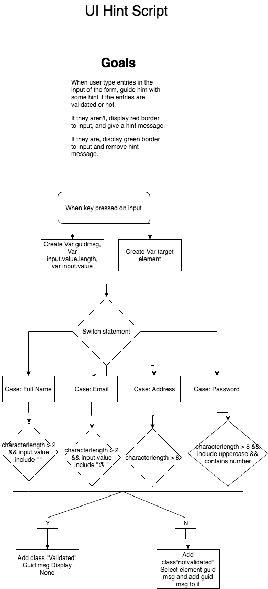
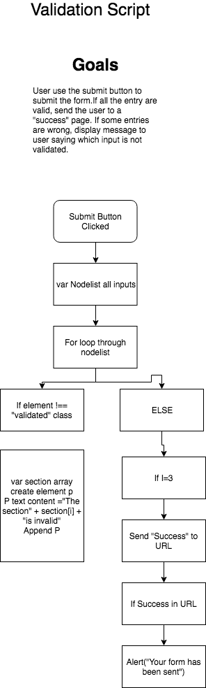

# FormValidationUI

A simple form, coded as part of training with Vanilla JS, Jquery & API's.

## Features
* Hint while typing
* Autocomplete Google Map Places API
* UI interactive elements
* Responsive

## Process

1/

Design a little mockup of the form

2/

Creating flowchart for the main functions of the form.

Technologies: HTML5, CSS3, JS.

API: Google Map Places

External Libraries: jQuery, granim.js.